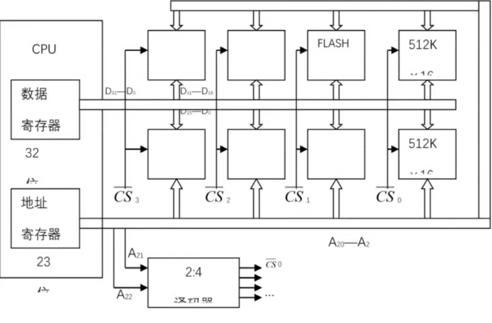

## 第三章

1. SRAM芯片有17位地址线和4位数据线。用这种芯片为32位字长的处理器构成1MX32比特的存储器，并采用内存条结构，问：

(1)若每个内存条为256KX32比特，共需几个内存条？

(2)每个内存条共需多少片这样的芯片？

(3)所构成的存储器需用多少片这样的芯片？

(1)1M=1024K，共需要内存条1024/256=4条。

(2)该芯片为$2^{17}$x4比特=128Kx4比特，故每个内存条需芯片(256/128)x(32/4)=16片。

(3)构成该存储器共需芯片4x16=64片。

2. 用512KX16位的Flash存储器芯片组成一个2MX32的半导体只读存储器，试问：
   
(1)数据寄存器多少位？

(2)地址寄存器多少位？

(3)共需要多少个这样的存储器件？

(4)画出此存储器的组成框图。

(1)数据寄存器位数=32位。

(2)地址寄存器位数=21位。

(3)共需存储器件=8片。

(4)存储器的组成框图如下：

3. 某机器中，已知配有一个地址空间为0000H~1FFFH(16进制)宇长16位的ROM区域。现在再用RAM芯片(8KX8位)形成16KX16位的RAM区域，起始地址为2000H。假设RAM芯片有CS和WE信号控制端。CPU地址总线为A15~A0，数据总线为D15~D0，控制信号为R/W(读/写)，MREQ(当存储器进行读或写操作时，该信号指示地址总线上的地址是有效的)。要求：

(1)画出地址译码方案。

(2)将ROM和RAM同CPU连接。

存储器地址空间分布如图2所示,分三组,每组8Kx16位。
由此可得存储器方案要点如下

- 组内地址:A12--A(A为低位);
- 组号译码使用2:4译码器:

RAM1,RAM2各用两片SRAM芯片位进行并联连接其中一片组成高8位,另一片组成低8位，

- 用MREQ作为2:4译码器使能控制端,该信号低电平(有致)时,译码器工作。
- CPU的R/W信号与SRAM的WE端速接,当R/W=1时存储器执行读操作,当R/W=0时,存储器执行写操作。

4.	某计算机系统的内存储器由cache和主存构成，cache的存取周期为45ns，主存的存取周期为200ns。己知在一段给定的时间内CPU共访问内存4500次，其中340次访问主存。问：

(1)cache的命中率是多少？

(2)CPU访问内存的平均时间是多少纳秒？

(3)cache-主存系统的效率是多少？

(1)Cache的命中率H=Nc/(Nc+Nm)=(4500-340)/4500=0.92

(2)CPU访存的平均时间:Ta=H*Tc+(1-H)Tm=0.92x45+(1-0.92)x200=57.4ns

(3)Cache-主存系统的效率E=Tc/Tax100%=45/57.4x100%=0.78x100%=78%

5.	请用图示说明三级存储体系分别由哪些部分组成，并比较cache-主存和主存辅存这两个存储层次的相同点和不同点。

三级存储体系由Cache存储器、主存和辅存组成。在Cache和主存,主存和辅存之间分别有辅助硬件和辅助软件负责信息的调度，以便各级存储器能够组成有机的三级存储体系。Cache和主存构成了系统的内存，而主存和辅存依靠辅助软、硬件的支持构成了虚拟存储器。在三级存储体系中,Cache-主存和主存-辅存这两个存储层次有如下两个相同点

(1)出发点相同:都是为了提高存储系统的性价比而构造的层次性存储体系

(2)原理相同:都利用了程序运行时的局部性原理

Cache-主存和主存-辅存这两个存储层次有如下四个不同点

(1)目的不同:Cache主要解决主存和cpu的速度差异问题;而虚存就性价比的提高而言主要是解决存储容量的问题

(2)数据通路不同:cpu与Cache和主存之间均有直接访问通路，Cache不命中时可以直接访问主存;在虚存中,辅存和cpU之间不存在直接的数据通路,当主存不命中时只能通过调进解决，即cpu要用的程序从辅存调入主存

(3)透明性不同:Cache的管理完全由硬件完成,对系统和用户程序均透明:而虚存管理由软件和硬件共同完成,对系统程序不透明,对用户程序透明

(4)未命中的损失不同

6.	某段页式虚拟存储系统，页大小为2KB，每个段的页表有8个表项。设某任务恰好被分成4个大小相等的段。问:

(1)每个段最大的长度是多少？

(2)此任务的最大逻辑地址空间有多大？

(1)每个段最多有8个页面,故每个段的最大长度是2KBx8=16KB。

(2)该任务有4个段,故此任务的最大逻辑地址空间为16KBx4=64KB。

7.	试分析在虚拟存储体系中，有哪些因素影响主存的命中率

(1)程序本身的特性,即程序在执行过程中的地址流分布情况。局部性比较好的程序主存命中率高。

(2)虚存系统所采用的页面替换算法。

(3)页面大小。页面大小与主存命中率不是线性关系，一般要通过对典型程序的模拟实验来确定。

(4)主存储器的物理容量。主存命中率随着分配给该程序的主存容量的增加面单调上升。

(5)系统所采用的页面调度方法。

## 第四章

1.	指令格式结构如下所示，试分析指令格式及寻址方式特点。

指令格式及寻址方式特点如下:

(1)二地址指令。

(2)操作码OP可指定 $2^6$=64 条指令。

(3)源和目标都是通用寄存器(可分别指定 32个寄存器)，所以是 RR 型指令，两个操作数均在寄存器中

(4)这种指合格式常用子算术逻辑类指令

2.	某32位处理器的指令格式结构如下所示，试分析指令格式及寻址方式特点。

操作码:定长操作码，可表示 64 条指令;

操作数:双操作数，可构成RS或SS型指令,有直接、寄存器、寄存器间接寻址方式，

访存范围1M，可表示 16 个寄存器。

3.	请写出8种寻址方式的名称，并指出哪几种访问存储器速度较慢。

常见的8种寻址方式及其访问存储器的速度特点如下：

1. **立即寻址（Immediate Addressing）**
   - **特点：** 操作数直接包含在指令中。
   - **存储器访问速度：** 快，因为不需要访问内存。

2. **直接寻址（Direct Addressing）**
   - **特点：** 指令中包含操作数的内存地址。
   - **存储器访问速度：** 较慢，因为需要一次内存访问来获取操作数。

3. **寄存器间接寻址（Register Indirect Addressing）**
   - **特点：** 使用寄存器中的值作为内存地址。
   - **存储器访问速度：** 较慢，因为需要访问内存。

4. **基址寻址（Base Addressing）**
   - **特点：** 基地址由寄存器提供，偏移量在指令中给出。
   - **存储器访问速度：** 较慢，因为需要计算地址后再访问内存。

5. **变址寻址（Indexed Addressing）**
   - **特点：** 基地址和变址寄存器的内容相加作为最终的内存地址。
   - **存储器访问速度：** 较慢，因为需要计算地址后再访问内存。

6. **相对寻址（Relative Addressing）**
   - **特点：** 地址由程序计数器（PC）和指令中给出的偏移量相加得到。
   - **存储器访问速度：** 较慢，因为需要计算地址后再访问内存。

7. **寄存器寻址（Register Addressing）**
   - **特点：** 操作数在寄存器中指定。
   - **存储器访问速度：** 快，因为不需要访问内存。

8. **隐含寻址（Implicit Addressing）**
   - **特点：** 操作数隐含在操作码中，或操作数在特定的寄存器中。
   - **存储器访问速度：** 快，因为不需要访问内存。

### 访问存储器速度较慢的寻址方式

以下几种寻址方式由于需要访问内存，导致访问速度较慢：

1. **直接寻址（Direct Addressing）**
2. **寄存器间接寻址（Register Indirect Addressing）**
3. **基址寻址（Base Addressing）**
4. **变址寻址（Indexed Addressing）**
5. **相对寻址（Relative Addressing）**

这些方式通常需要计算或访问内存地址，从而增加了访问时间。因此，在性能优化时，通常会尽量减少这几种寻址方式的使用。

4.	假设某计算机的指令长度为20位，具有双操作数、单操作数和无操作数三类指令，每个操作数地址规定用6位表示。若操作码字段固定为8位，现已设计出m条双操作数指令，n条无操作数指令。在此情况下，这台计算机最多可以设计出多少条单操作数指令？

这台计算机最多可以设计出 256-mm-n条单操作数指今

5.	机器字长32位，主存容量为1MB，16个通用寄存器，共32条指令，请设计双地址指令格式，要求有立即数、直接、寄存器、寄存器间接、变址、相对六种寻址方式。

根据题意,有32种操作码,故OP字段占5位,16个通用寄存器源和目的各占4位;寻址模式字段X占3位，剩余字段D为立即数和直接寻址使用,指令格式如下:

|  5位  |  3位  |  4位  |  4位  | 16位  |
| :---: | :---: | :---: | :---: | :---: |
|  OP   |   X   |  源   | 目的  |   D   |

寻址模式定义如下:
- X=000，立即数=D
- X=001，直接寻址，E=D
- X=010，寄存器直接寻址
- X=011，寄存器间接寻址 E=(R)
- X=100,变址寻址,E=(R)+D
- X=101.相对寻址，E=(PC)+D

## 第五章

1.	已知某机采用微程序控制方式，其控制存储器容量为512X48(位)。微程序可在整个控制存储器中实现转移，可控制微程序转移的条件共4个，微指令采用水平型格式，后继微指令地址采用多路转移方式，如下图所示。

(1)微指令中的三个字段分别应为多少位？

(2)画出对应这种微指令格式的微程序控制器逻辑框图。

假设判别测试字段中每一位为一个判别标志,那么由子有4个转移条件,故该字段为4位,下地址字段为9位,因此控制存储器容量为512个单元,微命令字段是(48-4-9)=35位。

对应上述微指令格式的微程序控制器逻辑框图如图 5.7 所示。其中微地址寄存
器对应下地址字，P宇段即为判别测试字段，控制字段即为微命令字段，后两部分组成微
指令寄存器。地址转移逻辑的输入是指令寄存器的 OP码、各种状态条件以及判别测试
宇段所给的判别标志(某一位为1)，其输出修改微地址寄存器的适当位数，从而实现微程
序的分支转移。 就是说，此处微指令的后继地址采用断定方式

2.	某32位机共有微操作控制信号52个，掏成5个相斥类的微命令组，各组分别包含4个、5个、8个、15个和20个微命令。已知可判定的外部条件有CY和ZF两个，微指令字长29位。

(1)给出采用断定方式的水平型微指令格式。

(2)控制存储器的容量应为多少位？

微指令的格式如下所示(注意各控制字段中应包含一种不发出命令的情况，条件测试字段包含一种不转移的情况)。

控存容量为 $2^8$ X29=256X29 (由于下一地址字段宽度为8，所以是$2^8$)

3.	指令流水线有取指(IF)、译码(ID)、执行(EX)、访存(MEM)、写回寄存器堆(WB)五个过程段，共有8条指令连续输入此流水线。

(1)画出流水处理的时空图，假设时钟周期100ns。

(2)求流水线的实际吞吐率（单位时间里执行完毕的指令数）。

(3)求流水处理器的加速比。

(1)时空图如下所示：

(2)$\frac{8}{12 \times 100 ns} = \frac{2}{3} \times 10^7 条指令/s$

(3)$\frac{8 \times 5}{12} = 3.33$

4.	假设一条指令的指令周期分为取指令、指令译码、执行指令三个子过程段，且这三个子过程延迟时间相等，即每个子过程延迟时间都为T。假设某程序共同n=10000条指令，请写出如下两种情况下CPU执行该程序所需的时间，画出时空图。

(1)指令顺序执行方式。

(2)指令流水执行方式。

执行n 条指令的总时间为t=3T * n=3nT=30000T

流水执行总时间为t =2T+nT=(n+2)T= (10000+2)T

5.	今有4级流水线，分别完成取指、指令译码并取数、运算、送结果四步操作，假设完成各步操作的时间依次为100ns，100ns，80ns，50ns，请问:

(1)流水线的操作周期应设计为多少？

(2)若相邻两条指令发生数据相关，而且在硬件上不采取措施，那么第2条指令要推迟多少时间进行？

(3)如果在硬件设计上加以改进，至少需要推迟多少时间？

(1)流水线的操作周期应按各步操作的最大时间来考虑，即流水线时钟周期τ=max{ri} =100ns。

(2) 遇到数据相关时，就停顿第 2 条指令的执行，直到前面指令的结果已经产生，因此至少需要延迟2个时钟周期。

(3) 如果在硬件设计上加以改进，如采用专用通路技术，就可使流水线不发生停顿。

## 第六章

(1)某总线在一个总线周期中并行传送4个字节的数据，假设一个总结周期等于一个总线时钟周期，总线时钟频率为33MHz，求总线带宽是多少？

(2)如果一个总线周期中并行传送64位数据，总线时钟频率升为66MHz，求总线带宽是多少？

(3)分析哪些因素影响带宽？

(1)设总统带宽用Dr 表示，总线时钟周期用 T=l/j表示，一个总线周期传送的数据量用D表示，根据定义可得
$$ Dr=D/T=D \times l/T=D \times f=4B \times 33M/s=132MB/s $$

(2) 因为 64 位=8B，所以
$$ Dr=D \times f=8B \times 66M /s=528MB/s $$

(3) 总线带宽是总线能提供的数据传送速率，通常用每秒钟传送信息的字节数(或位
数)来表示。影响总线带宽的主要因素有:总线宽度、传送距离、总线发送和接收电路工作频率限
制以及数据传送形式。

2.	单机系统中采用的总线结构有三种基本类型。请分析这三种总线结构的特点。

根据连接方式的不同，单机系统中采用的总线结构有以下三种基本类型:
 - 单总线结构。它是用一组总线连接整个计算机系统的各大功能部件，各大部件之
间的所有的信息传送都通过这组总线。单总线的优点是允许
I/O设备之间或 I/O设备与内存之间直接交换信息，只需CPU分配总线使用权，不需要
CPU 干预信息的交换。所以总线资源是由各大功能部件分时共享的.单总线的缺点是
由于全部系统部件都连接在一组总线上，所以总线的负载很重，可能使其吞吐量达到饱和
甚至不能胜任的程度.
 - 三总线结构。即在计算机系统各部件之间采用兰条各自独立的总线来构成信息
通路。这三条总线是：主存总线，输入/输出（I/O）总线和直接内存访问(DMA)总线。主存总线用于 CPU和主存之间传送地址、数据和控制信息;I/O总线供CPU 和各类外设之间通讯用;DMA总线使主存和高速外设之间直接传送数据。一般来说，在三总线系统中，任一时刻只使用一种总线。
- 双总线结构。它有两条总线，一条是系统总线，用于CPU、主存和通道之间进行
数据传送；另一条是 I/O 总线，用于多个外国设备与通道之间进行数据传送。双总线结构中，通道是计算机系统中的一个独立部件，使 CPU 的放率大为提高，并可以实现形式多样而更为复杂的数据传送。双总线的优点是以增加通道这一设备为代价的，通道实际上是一台具有特殊功能的处理器，所以双总线通常在大型计算机或服务器中采用。

3.	分析链式查询总线仲裁方式、独立请求总线仲裁方式电路的基本原理，说明其优缺点。

链式总线仲裁：在查询链中，离总线仲裁器最近的设备具有最高优先权，离总线仲裁器越远的设备，优先权越低。

链式查询方式的优点是:只用很少几根线就能按一定优先次序实现总线请求仲裁，并
且这种链式结构很容易扩充设备。其缺点是:对询问链的电路故障很敏感，如果第 z 个设
备的接口中有关链的电路有故障，那么，第 z 个设备以后的设备都不能进行工作。另外，
查询链的优先级是固定的;如果优先级高的设备出现频繁的请求，优先级较低的设备就可
能长期不能使用总线

独立请求总线仲裁方式：每一个共享总线的设备均有一对"总线请求"(BR)和"总线授权"(BG)线。当设备要
求使用总线时，便发出"总线请求"信号，总线控制部件中一般有一个排队电路，根据一定
的优先次序决定首先响应哪个设备的请求，当请求的设备排上队，便收到"总线授权"
 (BG)信号，从而可以使用总线。

独立请求方式的优点是:响应时间快，对优先次序的控制也是相当灵活的，它可以预
先固定，也可以通过程序来改变优先次序，并且可以在必要时屏蔽某些设备的请求。缺点
是:控制线数量多，为控制 n 个设备，必须有 2n 根"总线请求"和"总线授权"线，相比之下
链式查询方式只需2根，计数器定时查询方式只需约 log2n 根;另外，总线仲裁器也要复
杂得多。

4.	分析总线宽度对系统性能的影响。

总线需要有发送电路、接收电路、传输线(导线或电缆)、转接器(转换插头等)和
电源等。这部分比起逻辑线路的成本要高得多，而且转接器占去了系统中相当大的物理
空间，往往是系统中不可靠的部分。总线的宽度越宽，相应的线数越多，则成本越高、干扰
越大、可靠性越低、占用的物理空间也越大，当然传送速度和吞吐率也越高。此外，总线的
长度越长，成本就越高;干扰越大，可靠性越低。为此，越是长的总线，其宽度就应尽可能
减小。减小总线宽度的方法可采用线的组合、串/并行转换和编码技术。当然减少总线宽
度应满足性能要求以及与所用通信类型和速率相适应为前提。

5.	计算机系统采用"面向总线"的形式有何优点？

面向总线结构形式的优点主要有:
- 简化了硬件的设计。从硬件的角度看，面向总线结构是由总线接口代替了专门的
I/O接口，由总线规范给出了传输线和信号的规定，并对存储器、I/O设备和 CPU如何挂
在总线上都作了具体的规定，所以，面向总线的微型计算机设计只要按照这些规定制作
CPU 插件、存储器插件以及I/O插件等，将它们连入总线即可工作，而不必考虑总线的详细操作
- 简化了系统结构。 整个系统结构清晰，连线少，底板连线可以印刷化。
- 系统扩充性好。一是规模扩充，二是功能扩充。规模扩充仅仅需要多插一些同类
型的插件;功能扩充仅仅需要按总线标准设计一些新插件。插件插入机器的位置往往没
有严格的限制。这就使系统扩充既简单又快速可靠，而且也便于查错。
- 系统更新性能好。因为CPU、存储器、I/O接口等都是按总线规约挂到总线上的，
因而只要总线设计恰当，可以随时随着处理器芯片以及其他有关芯片的进展设计新的插
件，新的插件插到底板上对系统进行更新，而这种更新只需更新需要更新的插件，其他插
件和底板连线一般不需更改

6.	请画出用异步方式连续传送字符"a"和"6"的波形图，已知数据位为8位，起始位1位，停止位1位，奇偶校验位1位(奇校验)。

 "a"的 ASCII 码为 61H= 01100001B, 1 的个数为奇数，故校验位为 0;"6"的
ASCII 码为 36H=00110110B，1 的个数为偶数，故校验位为 1。波形如图

7.	设总线的时钟频率为8MHZ，一个总线周期等于一个时钟周期。如果一个总线周期中并行传送16位数据，试问总线的带宽是多少？

16MB/s

8.	在一个32位的总线系统中，总线的时钟频率为66MHZ，假设总线最短传输周期为4个时钟周期，试计算总线的最大数据传输率。若想提高数据传输率，可采取什么措施？

最大数据传输率为 66 MB/s

措施：增加时钟频率：提高总线的时钟频率，可以直接增加每秒钟的传输周期数，从而提高数据传输率。

增加总线宽度：增加总线的位数，例如从32位增加到64位，每个传输周期内传输更多的数据。

减少传输周期的时钟周期数：减小最短传输周期所需的时钟周期数，例如从4个时钟周期减少到2个时钟周期，从而提高传输率。

使用更高效的传输协议：例如采用流水线技术或使用双倍数据速率（DDR）技术，在时钟的上升沿和下降沿都进行数据传输，从而在相同时钟频率下提高数据传输率。

使用多通道并行传输：采用多通道并行传输方式，例如在同一时间内使用多条总线进行数据传输。

9.	在异步传输系统中，字符格式为：1个起始位、8个数据位、1个校验位、2个终止位.若要求传输120个字符，求传送的波特率和比特率？

这题出的有问题

## 第七章

一、	某CRT显示器可显示128种ASCII字符，每帧可显示80字X25排；每个字符字形采用7X8点阵，即横向7点，字间间隔1点，纵向8点，排间间隔6点；帧频50Hz，采取逐行扫描方式。问：

(1)缓存容量有多大?

(2)字符发生器(ROM)容量有多大?

(3)缓存中存放的是字符ASCII代码还是点阵信息?

(4)缓存地址与屏幕显示位置如何对应?

(5)设置哪些计数器以控制缓存访问与屏幕扫描之间的同步?它们的分频关系如何?

CRT显示器缓存与屏幕显示间的对应关系:

(1)缓存容量   80X25=2KB 

(2) ROM 容量    128X7X8=7KB 

(3) 缓存中存放的是待显示字符的 ASCII代码。

(4) 显示位置自左至右，从上到下，相应地缓存地址由低到高，每个地址码对应一个
字符显示位置。

(5) ①点计数器(7+1) : 1 分频(每个字符点阵横向 7个点，间隔 1个点)。
②宇符计数器(80+12) : 1 分频(每一水平扫描线含 80个字符，回归和边缘部分等
消隐段折合成12个字符位置)。
③行计数器(8+6) : 1 分频(每行字符占 8点，行间隔 6 点)。
④排计数器(25十10) : 1 分频(每帧 25 行，消隐段折合为 10行).

二、	一盘组共11片，记录面为20面，每面上外道直径为14英寸，内道直径为10英寸，分203道。数据传输率为983040字节/秒，磁盘组转速为3600转/分。假定每个记录块记录1024字节，且系统可挂多达16台这样的磁盘，请设计适当的磁盘地址格式，并计算总存储容量。

设数据传输率为C，每一磁道的容量为N，磁盘转速为r，则根据公式C=N-r，可求得

N=983040/(3600/60)=16384字节每圈

扇区数 = 16382 / 1024 = 16个扇区

故表示磁盘地址格式的所有参数为z台数16，记录面 20，磁道数 203道，扇区数 16，由此
可得磁盘地址格式为

| 20 17 |  16 9  |  8 4   |  3 0   |
| :---: | :----: | :----: | :----: |
| 台号  | 柱面号 | 盘面号 | 扇区号 |

磁盘总存储容量为16 X 20 X 203 X 16384=1064304640(B) 

三、	CD-ROM光盘的外缘有5mm宽的范围因记录数据困难，一般不使用，故标准的播放时间为60min。计算模式1和2情况下光盘存储容量是多少?

1倍速的CD光驱每秒钟能够读取75个连续的扇区

采用模式1型的CD-ROM拥有完整的3层纠错机制，每个扇区记录2048字节信息。模式2型的CD-ROM，每个扇区记录2336字节信息

模式一：60X60X75X2048=527MB

模式二：60X60X75X2336=601MB

## 第八章

什么叫接口?接口有什么功能?基本组成包括哪些部件?

接口是外部设备与主机间通信的桥梁，也称适配器。

接口的主要功能是:

1. 接收主机发来的命令，控制外部设备操作。
2. 反映设备工作状态，以便主机发出不同的控制命令
3. 作为I/0设备与主机间传送数据的缓冲，暂时存放等待主机取走或设备取走的数据。
4. 中断逻辑，当今多数设备以中断方式与主机通信，接口中应设置中断控制逻辑。

接口基本组成包括:
- 设备选择电路
- 数据缓冲寄存器
- 控制与状态寄存器
- 中断请求与屏蔽电路
- 在串行接口中还应包括数据格式串并行转换电路。
  

说明外围设备的I/0控制方式分类及其特点。

1. 程序查询方式:CPU和操作和外围设备的操作能够同步，且硬件结构比较简单。
2. 程序中断方式:-般适用于随机出现的服务，且一旦提出要求应立即响应，节省CPU的时间开销，但其硬件结构要稍微复杂一些
3. 直接内存访问(DMA)方式:数据传送速度很高，传送速率仅仅受到内存访问时间的限制。需要更多硬件，适用于内存和高速外设之间大批数据交换的场合。
4. 通道方式:可实现对外设的统一管理和外设与内存之间的数据传送,显著提高CPU的工作效率
5. 外围处理机方式:是通道方式的进一步发展，基本上独立于主机工作，结构更接近于一般处理机

[相关链接](https://www.cnblogs.com/niuyourou/p/12588407.html)

何谓DMA方式?DMA控制器可采用哪几种方式与CPU分时使用内存?

直接内存访问(DMA)方式是一种完全由硬件执行I/O交换的工作方式。DMA控制器从CPU完全接管对总线的控制。数据交换不经过CPU，而直接在内存和1/0设备之间进行。 

DMA控制器采用以下三种方式:

1. 停止CPU访问内存:当外设要求传送一批数据时，由DMA控制器发一个信号给CPU。DMA控制器获得总线控制权后，开始进行数据传送。一批数据传送完毕后，DMA控制器通知CPU可以使用内存，并把总线控制权交还给CPU。
2. 周期挪用:当I/O设备没有DMA请求时，CPU按程序要求访问内存:一旦I/O设备有DMA请求，则I/O设备挪用一个或几个周期。
3. DMA与CPU交替访内:一个CPU周期可分为2个周期，一个专供DMA控制器访内，另一个专供CPU访内。不需要总线使用权的申请、建立和归还过程。

为什么DMA方式比中断方式具有更高的I/0效率?

中断方式只是解决了CPU对I/0设备状态的查询和等待，但数据传送仍然需要CPU参与和中转，以输入为例，CPU从外设读取数据到寄存器 ,再将寄存器中的数据存储到内存中;而在DMA方式下，数据传送在DMA控制器的控制下直接在内存和外设间传送，既不需要CPU的参与也没有了中断开销，所以DMA方式具有更高的I/O效率。

下图是以程序查询方式实现与多台设备进行数据交换的程序流程图；试分析这种处理方式(图中实线表示的方式)存在的问题以及改进措施。

这种处理方式一旦发现某个设备可供使用，或者发现它需要服务，控制方向就转到与这个设备有关的服务程序，服务结束，将控制方向转到主程序，而不再继续检查任何其他设备的特征触发器。因此，只有那些在查询顺序中排在前面的特征触发器才经常被检查。在查询子程序进行查询时，如果一台优先权较高的设备可以使用，所有优先权较低的设备都得不到服务。

改进方法：将控制方向转回查询子程序(如图中虚线所示),继续检查排在刚才能用的那台设备后面的那些设备。如果发现有新的设备可用，或者发现它需要服务，就把控制方向转到这个新设备的服务程序上，在这个服务结束时，控制方向又转回查询子程序;从返回点开始，查询子程序又继续检查下一个优先权较高的设备能否使用;用这种方法，控制方向每转人查询子程序一次，查询序列就通过一次;只有在所有的设备都已查询过了，控制方向才转向主程序。因此，没有哪一个设备长时间得不到服务，只有先后的差别，机会是相等的，

假设磁盘采用DMA方式与主机交换信息，其传输速率为2MB/s，而且DMA的预处理需1000个时钟周期，DMA完成传送后处理中断需500个时钟周期。
(1)CPU对DMA请求和中断请求的响应时间是否一样?为什么?
(2)如果平均传输的数据长度为4KB。试问在硬盘工作时，50MHz的处理器需用多少时间比率进行DMA辅助操作(预处理和后处理)？

不一样，因为两种方式的交换速度相差很大，因此，CPU必须以更短的时间隔离查询并响应DMA请求。响应中断请求是在每条指令执行周期结束的时刻，而响应DMA请求是在存取周期结束时刻。中断方式是程序切换，而程序又是由指令组成，多以必须在一条指令执行完毕才能响应中断请求，而且CPU只有在每条指令执行周期结束时刻才发出查询信号，以获取中断请求信号，若此时条件满足，便能响应中断请求。

DMA请求是由DMA接口根据设备工作状态向CPU申请占用总线，此时只要总线未被占即可立即响应DMA请求，若总线正被CPU占用，则必须等待该存取周期结束时，CPU才交出总线的使用权。

1s 时间内，磁盘传输 2MB 数据，DMA 可以每次传输 4KB，则 DMA 传输次数 = 2MB/4KB = 500 次。

DMA 每次传输前的预处理和传输完成后向 CPU 发起的中断处理，需要的时间周期数为 500+1000 = 1500，则 500 次 DMA 传送总共需要花费 1500*500 个时钟周期。

1s 时间内，处理器一共有 50M 个时钟周期，因此比率为 (1500*500)/50M = 1.5%。

[参考链接](https://www.cnblogs.com/Mount256/p/16693258.html)

## 第九章

试比较超线程处理机与多核处理机的优劣。

超线程技术是在原有单线程处理机的基础上增加少量成本(复制必要的线程上下文相关的部件),允许处理机在同一个周期从不同的线程取指令发射与执行。不同的线程共享同一个流水线。超线程技术能够有致地提高芯片上的资源利用率，本质上仍然是多个线程共享一个处理机核。因此，采用超线程技术是否能获得的性能提升依赖子应用程序以及硬件平台。资源冲实会限制处理机的并行操作能力。多核处理机技术把多个独立的处理机核集成到同一个芯片之上,利用片上更高的通信带宽和更短的通信时延,挖掘出线程级的更高并行性。每个线程都具有完整的硬件执行环境,故各线程之间可以实现直正意又上的并行。由子多个处理机核相互独立,故在运行多个线程时不会引起资源竞争。但多核架构中灵活性的提升是以牺牲资源利用率为代价的。

可以同时应用超线程技术和多核技术，以提高处理机的性能。

如果一条指令的执行过程分为取指令、指令分析、指令执行三个子过程，且取指令、分析指令、执行指令三个过程段的时间都是∆t，分别求指令顺序执行、指令流水执行两种方式执行n=2000条指令所用的总时间。

顺序执行：每条指令的执行时间为3∆t，总时间为3n∆t=6000∆t

流水线执行：每条指令的执行时间为∆t，总时间为n∆t+2∆t=2002∆t

设有k=4段指令流水线，各功能段分别为取指令、指令译码、指令执行和结果写回，分别用S1、S2，S3和S4表示，各段延迟时间均为∆t。若连续输入n条指令，请画出指令流水线的时空图。
(1)推导流水线吞吐率P的公式，它定义为单位时间中输出的指令数；
(2)推导流水线加速比S的公式，它定义为顺序执行n条指令所用时间与流水执行n条指令所用时间之比；
(3)推导流水线效率E的公式，它定义为n条指令占用的时空区有效面积与在k个流水段中执行n条指令占用的矩形时空区总面积之比

吞吐率定义：单位时间内输出的指令数

$$ P = \frac{n}{(n + 3)\Delta t} $$

加速比定义：顺序执行n条指令所用时间与流水执行n条指令所用时间之比

$$ S = \frac{4n}{n+3} $$

流水线效率定义：n条指令占用的时空区有效面积与在k个流水段中执行n条指令占用的矩形时空区总面积之比

$$ E = \frac{n}{n+3} $$

假设某同构多核处理机有n个处理机核，各个核通过共享总线方式访问共享主存存取数据，且各个处理机核均配备私有的指令存储器空间。若平均每四条指令中有一条指令需要访问共享数据存储空间，且访存时在整个指令周期中都占用总线。
(1)若n=32，该处理机比单核处理机运行速度快多少?
(2)若n=64，该处理机比单核处理机运行速度快多少?

(1) n=32时，在32个指令执行时间内平均每个核将获得1次访问数据存储空间的机会,而每访问1次数据存储空间将可以执行4条指令。故在32个指令执行时间内可执行32x4=128条指令。而单核处理机在32个指令执行时间内可执行32条指令。故32核处理机与单核处理机相比,速度仅提高128/32=4倍。

(2) n=64时同理，也是4倍。

多处理机系统和多计算机系统的差别是什么？

多处理机系统和多计算机系统都属于多机系统，但多处理机系统和多计算机系统的差别是:
1. 多处理机是多台处理机组成的单机系统，多计算机是多台独立的计算机。
2. 多处理机中各处理机逻辑上受统一的操作系统控制，而多计算机的操作系统逻辑上是独立的。
3. 多处理机间以单一数据、向量、数组和文件交互作用，多计算机经通道或者通信线路以数据流的方式进行交互。
4. 多处理机作业、任务、指令、数据各级并行，多计算机多个作业并行。

